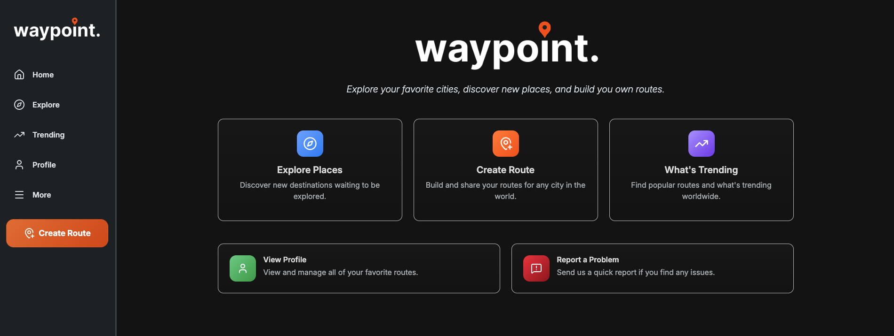
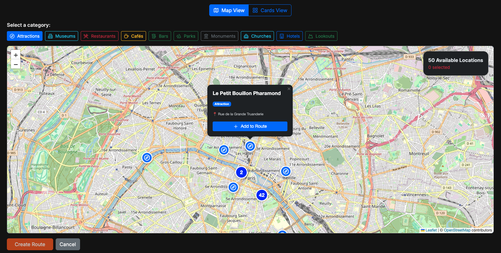
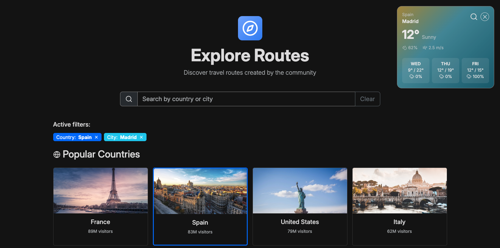
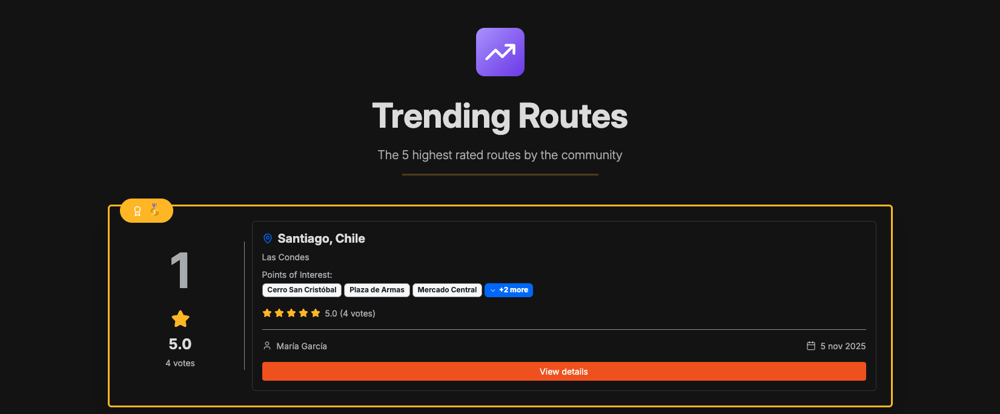
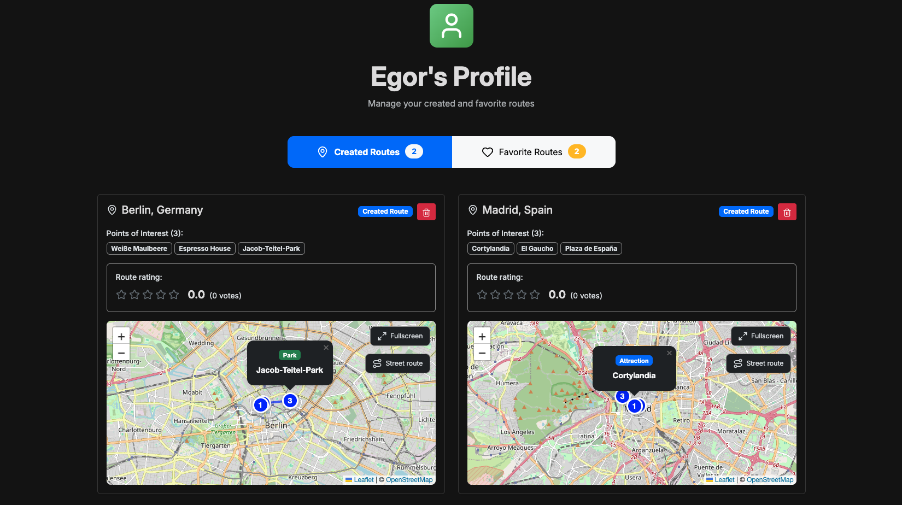
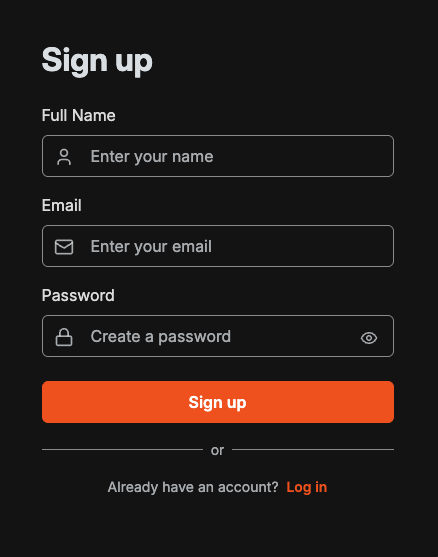
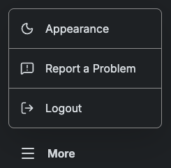

# Waypoint

**A full-stack web application for discovering and creating custom travel routes with interactive maps, POI (Points of Interest) management, and community-driven ratings.**

## 📖 About Waypoint

**Waypoint** is a modern travel route planning platform that allows users to discover, create, and share custom travel routes. Whether you're planning a city tour, a hiking trail, or a food adventure, Waypoint provides the tools to create detailed, interactive routes that can be shared with the community.

**Waypoint is deployed on AWS using Docker containers**, providing scalable and reliable hosting for the full-stack application.

### Key Highlights

- **Interactive Map Creation**: Build routes by selecting POIs directly on an interactive Leaflet map with Nominatim geocoding.
- **Smart POI Discovery**: Search and filter attractions, restaurants, parks, monuments, and more using OpenStreetMap data.
- **Community-Driven**: Rate, favorite, and explore routes created by other users.
- **Real-Time Weather**: Get weather forecasts for your selected destinations.
- **Routing Options**: Calculate distances and visualize routes via car, bike, or walking.
- **Responsive Design**: Fully optimized for desktop, tablet, and mobile devices.

## 📍 Create Route Page

The heart of Waypoint - an intuitive route builder with powerful features:

- **Location Selection**
  • Quick access to popular destinations via visual cards.
  • Search for any location worldwide using Nominatim geocoding.

- **Interactive Map Interface**
  • Search and discover POIs near your location with a real-time map powered by Leaflet and OpenStreetMap.
  • Categories like Attractions, Museums, Restaurants, Cafes, Bars, Parks, Monuments, and more.
  • Click to add POIs markers to your route with automatic ordering.

- **Route Visualization**
  • Calculate route distance and duration for multiple transport options (Car, Walking, Bike).
  • Interactive polyline rendering between POIs for standard size and full screen maps.

## 🔎 Explore Page

Discover routes created by the community with smart filtering:

- **Search & Filter**
  • Fast access to popular country and city cards to quickly select your destination.
  • Search for cities manually to explore routes created by other users at that destination.

- **Weather Integration**
  • Real-time weather widget that updates automatically when the destination changes.
  • Displays temperature, conditions, humidity, wind speed, and a three-day forecast.

## 📈 Trending Page

Discover the best routes ranked by the community:

- **Top 5 Routes**
  • Routes ranked by average rating. 🥇 🥈 🥉
  • Secondary sorting by total votes, and tertiary sorting by creation date.
  • View route details with integrated full screen map.

## 👤 Profile Page

Manage your routes and track your travel planning journey:

- **My Routes**
  • Browse all your created routes and see favorites you've saved from others.
  • Interactive route cards with expandable POI lists and statistics.
  • Delete routes you no longer need.

## ⚙️ Additional Features

  
  
  

- **User Experience**
  • Secure login and signup forms for user authentication.
  • Guest browsing with read-only route preview.
  • Problem reporting system for app issues.
  • Fully responsive design (mobile, tablet, desktop).
  • Dark mode support with persistent theme.

## 🚀 Deployment

**Custom Domain:** https://www.waypoint-app.dev/search

Waypoint is deployed to AWS (Amazon Web Services) using a containerized architecture with Docker, providing a scalable and production-ready infrastructure.

### Deployment Architecture

- **Container Platform**: Docker multi-stage builds for optimized production images
- **Cloud Provider**: AWS (Amazon Web Services)
- **Container Orchestration**: AWS ECS (Elastic Container Service) with Fargate
- **Database**: Amazon RDS PostgreSQL (managed database service)
- **Load Balancing**: Application Load Balancer (ALB) for traffic distribution
- **Networking**: VPC with public/private subnets for security

### Custom DNS & Domain Configuration

The application is accessible via a custom domain configured through AWS Route 53:

- **Domain Registrar**: Domain purchased and managed through a domain provider
- **DNS Service**: AWS Route 53 for DNS management and routing
- **SSL/TLS Certificate**: AWS Certificate Manager (ACM) for HTTPS encryption

## 🧠 Tech Stack

### Frontend

- **Framework**: React 18.2 with Hooks (useState, useEffect, useReducer, useContext).
- **Build Tool**: Vite 4.4 for lightning-fast development.
- **Routing**: React Router v6 for SPA navigation.
- **Maps**: Leaflet + React-Leaflet for interactive maps.
- **Geocoding**: Nominatim API for location search.
- **Routing**: OpenRouteService for route calculations.
- **State Management**: Context API (AuthContext, StoreContext).
- **Styling**: Bootstrap 5.3 + Custom CSS.
- **Icons**: Lucide React for modern, customizable icons.

### Backend

- **Framework**: Flask 1.1.2 (Python web microframework).
- **ORM**: SQLAlchemy 1.3.23 with Alembic migrations.
- **Database**: PostgreSQL (production) / SQLite (development).
- **Authentication**: JWT-based token system.
- **Password Hashing**: Flask-Bcrypt.
- **CORS**: Flask-CORS for cross-origin requests.

### External APIs

- **OpenStreetMap**: POI data and location search.
- **Nominatim**: Geocoding and reverse geocoding.
- **OpenRouteService**: Route calculation (car, bike, walking).
- **OpenWeatherMap**: Real-time weather data.
- **Unsplash**: POI image sourcing.

## 🙋‍♂️ Creators

**Egor Ulybin Merkulaev**: [@eulybin](https://github.com/eulybin)  
**Victor Manuel Moreno Cabello**: [@VictorPko73](https://github.com/VictorPko73)

### Acknowledgments

- **4Geeks Academy** - Initial React-Flask template.
- **OpenStreetMap** - Map data and POI information.
- **Leaflet** - Interactive mapping library.
- **Unsplash** - High-quality POI images.
- **OpenRouteService** - Route calculation API.
- **OpenWeatherMap** - Weather data API.
